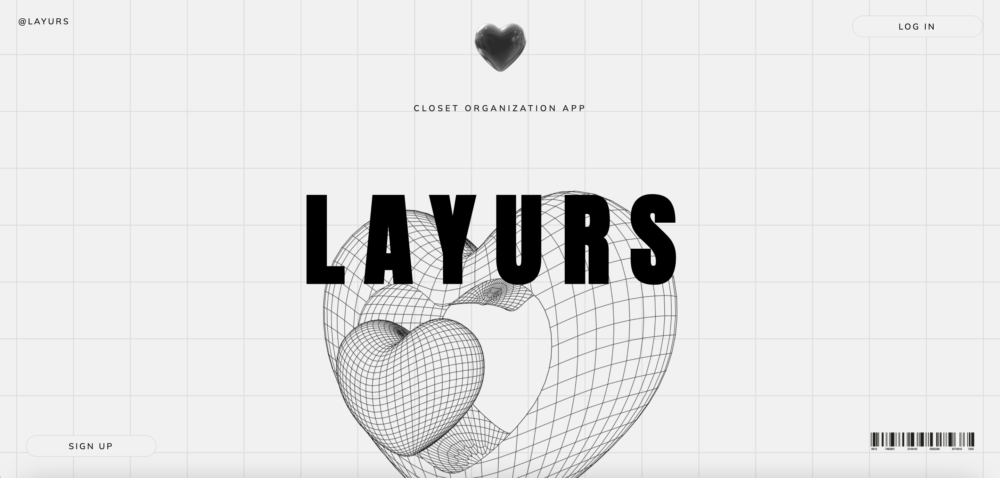
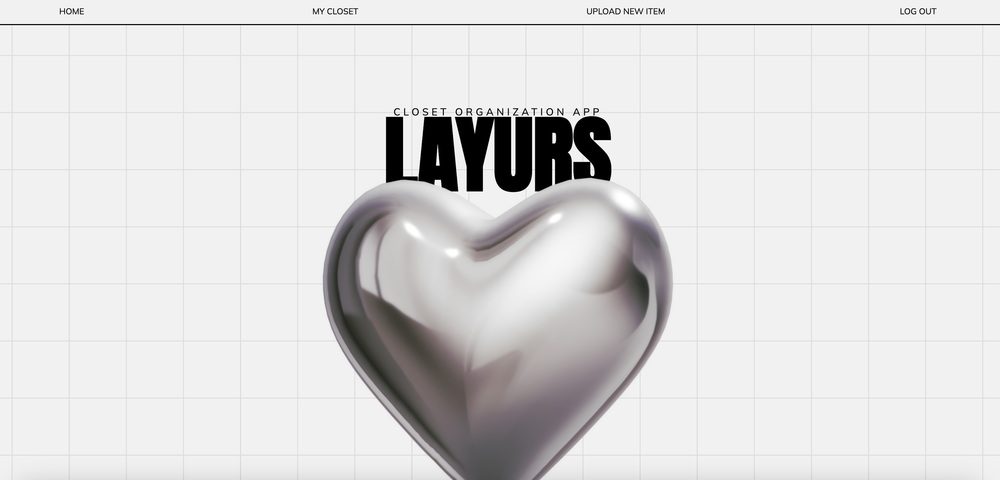
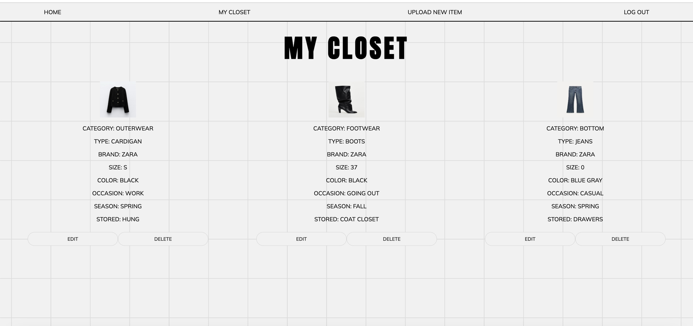

# LAYURS

  

 

## Description

A closet organization app helping you keep track of your items and where they are stored.

## 📸 : Screenshots 

  |   Description | Screenshot | 
  |:-------------:| -----------|
| <h3>HOME PAGE</h3> |  |
| <h3 align="center">MY CLOSET</h3> |  |

# 💻 : Technologies Used

MongoDB
Mongoose
React
CSS
Express.js
Node.js
Trello
Canva

# 🔥 Getting Started

[View Project Planning](https://trello.com/b/aaU1ZcPf/project-4-layurs)

[LAYURS](https://layurs-8c379c5d8e27.herokuapp.com/)

# ⏭️ Next Steps

- Add Filtering and outfit creation